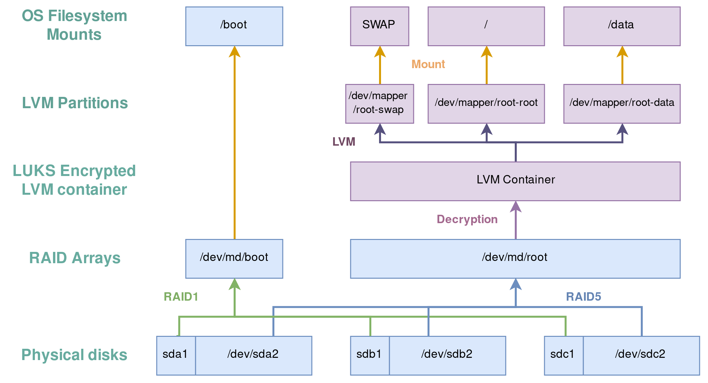

Higly secure Vault on a bare metal server
=========================================

Medical records, financial data, passwords for anything, e-mail...The personal,
sensitive and very-inconvenient-to-lose data stored on the Internet gets bigger
every day.

Whether you're a hobbyist running a personal servers at home, in a remote
datacenters or someone building such systems in production, you're likely to be
interested in two things: *not losing your data*, and *protecting it from
theft*.

That's the two topic we'll cover in these series !

TL&DR
-----
 1. we'll describe how to set up a [RAID5 array of
    disks](https://en.wikipedia.org/wiki/RAID) on your server (this translates
    easily to any RAID setup you'd like). In non technical terms, this means
    that we'll make sure your data is replicated on multiple disks so that the
    loss of one disk *won't result in a data loss*

 2. you'll learn how to *encrypt the data* written on these disks

 3. you'll make it possible to unlock your server at boot by SSH-ing on it
   during early boot and inputting your encryption key.

 4. we'll quickly set up an `iptables` firewall to *prevent unwanted network
    traffic from reaching your server*

Even if you use to work in cloud environments, what you'll learn can be
beneficial:
 * you can encrypt the data disk of instances you dedicate to storing sensitive
   data without giving your cloud provider access to the encryption keys.
 * leveraging RAID on the cloud is possible: RAID on NAS-volumes can increase
   I/O performance without having to pay for extra bandwidth

A note about security
---------------------

When designing security around & into a system, it's important to assess the
limits induced by our decisions (that applies to systems design in general):
disk encryption only prevents people **with physical access to your server**
from reading data on it.

You're, however, still vulnerable to [physical memory (RAM)
attacks](https://privatecore.com/resources-overview/physical-memory-attacks/index.html).

This being said, these are much more expensive, difficult to exploit and require
high end skills and hardware to be conducted successfully, if you want to
protect yourself against this class of attacks, hosting your server in a trusted
location is the only way (well, [for now at
least](https://en.wikipedia.org/wiki/TRESOR)).

Also, keep in mind that someone with remote access to your server will be able
to access your data. Remote access has to be prevented by configuring a
firewall. We'll quickly see how.

Last, but not least, don't forget to encrypt inbound & outbound traffic to/from
your machine (with TLS, for instance) to prevent attackers from sniffing your
traffic.

The ingredients
---------------

To illustrate the article, we'll rely on a concrete "how-to" if you want to "do
that at home". We'll use

* a PRO 4-S bare metal server rented at [online.net](https://www.online.net/en)
  with 3 attached SSD disks (if you have only 2 disks, RAID1 will provide good
  data integrity guarantees as well). If you have just one disk, you can skip
  the RAID-related part of the how-to

* ArchLinux

* a bit of patience

Keep in mind that the commands described in the article can easily translate to
other environments (another provider or a server you have physical access to).

Filesystem design
-----------------

* The base layer is replicated over the three disks we have at hand as follows:

  - RAID1 (mirroring) is used for the `/boot` partition (we won't encrypt it,
    but [that's
    possible](https://wiki.archlinux.org/index.php/Dm-crypt/Encrypting_an_entire_system#Encrypted_boot_partition_.28GRUB.29)
    if you need to. In case a disk fails, we can still tell the BIOS to boot on
    another disk.

  - RAID5 (providing both redundancy and I/O performance improvements) for the
    rest of the data

* this data will be fully encrypted using the [LUKS
  standard](https://fr.wikipedia.org/wiki/LUKS) This provides us data
  durability.

* Atop the encryption container, we'll be using LVM in order to have more
  flexibility on our partition layout over time. That's of course, something
  that can be skipped entirely (if you prefer to have just your single
  root partition directly atop the encryption container).

  - a `/` partition (ideally, of a size that won't change over the server's
    lifetime)
  - a `swap` partition
  - a `/data` partition

It's time get our hands dirty !

[Step 1: running an ArchLinux ISO on the server](./01_environment_setup.md)

