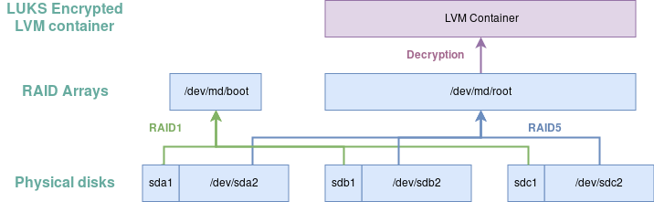
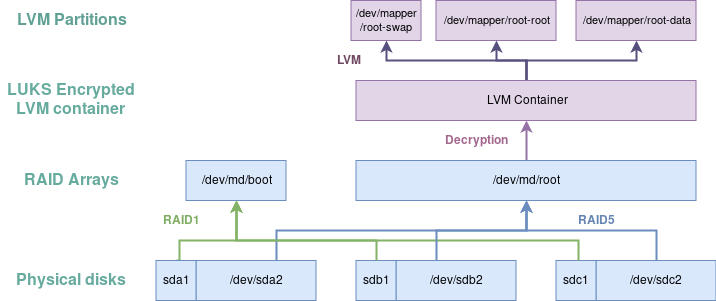

Step 2 - Setting up the filesystem
==================================

In this step, we're going to set up our entire filesystem, from physical disks
to the mounts forming the machine's filesystem. As a reminder, here's the layout
we're going for:


1 - Disk partitioning and software RAID
---------------------------------------

### a - Preparing the disks


First thing to do is figure out the UNIX paths for disks attached to your
server, which can be done with a simple `lsblk`. Here's what it looks like on my
end:

```
loop0       7:0    0 462.5M  1 loop  /run/archiso/sfs/airootfs
sda         8:0    0 238.5G  0 disk
sdb         8:16   0 238.5G  0 disk
sdc         8:32   0 238.5G  0 disk
sr0        11:0    1   573M  0 rom   /run/archiso/bootmnt
```

As we can see, we have three disks, `sda`, `sdb` and `sdc`. We'll create a small
`/boot` partition at the beginning of each of these disks and RAID-1 these
partitions. In case the `/boot` partition on `/dev/sda` is corrupted, simply
switching the boot device to `/dev/sdb` should do the trick :)

We'll assume your BIOS supports GPT partition tables, if not, you can
perform a similar work [using an MBR partition table](TODO) and [legacy BIOS
boot](TODO).

We'll also assume BIOS Boot (no UEFI) as it's what's running on the machine I
have at hand.

TODO: UEFI or BIOS, how to know ?

#### Layer description

* On each of our disk, we will create a small Bios BOOT partition.
* The rest of the disks will be dedicated to our encrypted RAID5 array


#### Partitioning `/dev/sda` with `fdisk` - BIOS Boot

We'll first partition `/dev/sda` and then copy the partition table to the other
disks. Let's get started with `fdisk /dev/sda`,

 1. Create a GPT partition table with `g`
 2. Type `n` to create a BIOS boot partition at the first sector, with a `+1M`
    size.
 3. Change the partition type to `4: BIOS Boot` with `t`
 4. Create the second partition (`boot`) with `n`, have it span `1G`
 5. Change the partition Type to `29: Linux RAID` with `t`
 6. Create the second partition with `n`, have it take all the remaining space
 7. Change the partition type to `29: Linux RAID` with `t`
 8. Write the partition table to disk and exit with `w`

`fdisk` transcript:
```
Welcome to fdisk (util-linux 2.32.1).
Changes will remain in memory only, until you decide to write them.
Be careful before using the write command.


Command (m for help): g
Created a new GPT disklabel (GUID: 3895F5C6-5939-284D-AF3E-C1A037D459C0).

Command (m for help): n
Partition number (1-128, default 1):
First sector (2048-500118158, default 2048):
Last sector, +sectors or +size{K,M,G,T,P} (2048-500118158, default 500118158): +1M

Created a new partition 1 of type 'Linux filesystem' and of size 1 MiB.

Command (m for help): t
Selected partition 1
Partition type (type L to list all types): 4
Changed type of partition 'Linux filesystem' to 'BIOS boot'.

Command (m for help): n
Partition number (2-128, default 2):
First sector (4096-500118158, default 4096):
Last sector, +sectors or +size{K,M,G,T,P} (4096-500118158, default 500118158): +1G

Created a new partition 2 of type 'Linux filesystem' and of size 1 GiB.

Command (m for help): t
Partition number (1,2, default 2):
Partition type (type L to list all types): 29

Changed type of partition 'Linux filesystem' to 'Linux RAID'.

Command (m for help): n
Partition number (3-128, default 3):
First sector (2101248-500118158, default 2101248):
Last sector, +sectors or +size{K,M,G,T,P} (2101248-500118158, default 500118158):

Created a new partition 3 of type 'Linux filesystem' and of size 237.5 GiB.

Command (m for help): t
Partition number (1-3, default 3):
Partition type (type L to list all types): 29

Changed type of partition 'Linux filesystem' to 'Linux RAID'.

Command (m for help): w
The partition table has been altered.
Calling ioctl() to re-read partition table.
Syncing disks.
```

Now, `lsblk` should output something like:
```
NAME   MAJ:MIN RM   SIZE RO TYPE MOUNTPOINT
loop0    7:0    0 462.5M  1 loop /run/archiso/sfs/airootfs
sda      8:0    0 238.5G  0 disk
├─sda1   8:1    0     1M  0 part
├─sda2   8:2    0     1G  0 part
└─sda3   8:3    0 237.5G  0 part
sdb      8:16   0 238.5G  0 disk
sdc      8:32   0 238.5G  0 disk
sr0     11:0    1   573M  0 rom  /run/archiso/bootmnt
```

#### Replicating the partition table on the other disks

To avoid going through the same process (and potentially messing something up)
for the other disks, we'll use [sfdisk](https://wiki.archlinux.org/index.php/Fdisk#Using_sfdisk)
to dump the partition table on `/dev/sda` and restore it on `/dev/sdb` and
`/dev/sdc`:

```shell
sfdisk -d /dev/sda > partitiontable.dump

# As you can see, the dump file simply is a text file that you can store
anywhere you'd like to
cat partitiontable.dump

# OUTPUT:
label: gpt
label-id: 3895F5C6-5939-284D-AF3E-C1A037D459C0
device: /dev/sda
unit: sectors
first-lba: 2048
last-lba: 500118158

/dev/sda1 : start=        2048, size=        2048, type=21686148-6449-6E6F-744E-656564454649, uuid=3FFC9B66-0282-F74D-9ADC-3657935439F7
/dev/sda2 : start=        4096, size=     2097152, type=A19D880F-05FC-4D3B-A006-743F0F84911E, uuid=2E0AEC84-8733-1140-BD72-32E5B7033B4E
/dev/sda3 : start=     2101248, size=   498016911, type=A19D880F-05FC-4D3B-A006-743F0F84911E, uuid=5E3F1C24-A25A-B04C-B585-C7B95BE19CCB
```

Let's replicate this partition layout to `/dev/sdb` and `/dev/sdc`:

```shell
sfdisk /dev/sdb < partitiontable.dump
sfdisk /dev/sdc < partitiontable.dump
```

These operation  should result in the following `lsblk` output:
```
NAME   MAJ:MIN RM   SIZE RO TYPE MOUNTPOINT
loop0    7:0    0 462.5M  1 loop /run/archiso/sfs/airootfs
sda      8:0    0 238.5G  0 disk
├─sda1   8:1    0     1M  0 part
├─sda2   8:2    0     1G  0 part
└─sda3   8:3    0 237.5G  0 part
sdb      8:16   0 238.5G  0 disk
├─sdb1   8:17   0     1M  0 part
├─sdb2   8:18   0     1G  0 part
└─sdb3   8:19   0 237.5G  0 part
sdc      8:32   0 238.5G  0 disk
├─sdc1   8:33   0     1M  0 part
├─sdc2   8:34   0     1G  0 part
└─sdc3   8:35   0 237.5G  0 part
sr0     11:0    1   573M  0 rom  /run/archiso/bootmnt
```

### b - Assembling the disks into a RAID array


#### Choosing your RAID level

We'll know assemble our disks into software RAID arrays. Since, in our example,
we have 3 disks, we went for a RAID5 array which provides both data redundancy
(like RAID1) and improved disk size and I/O performance (like RAID0).

If you have only two disks at hand depending on wether you prefer redundancy
(because you don't want to risk loosing your data) or disk space and
performance, you can opt for RAID1 or RAID0. If you have 4 disks or more at
hand, you may look into RAID6 instead.

The [ArchLinux Wiki](https://wiki.archlinux.org/index.php/RAID#RAID_levels) will
guide you through the process of choosing the RAID level that works best for
your use case. As for our article, we'll proceed with RAID5. Keep in mind that
this article provides a very basic overview of what RAID can do, in particular,
we won't dive into spare devices or containers. Neither do we talk about
administering a RAID array (what to do in case a disk fails, how to add new
disks to the array...).

The ArchLinux wiki - as always - provides good, easy-to-understand, tutorials
and introductory documentation. However don't forget to check the `manpage`s.
They often contain all the informations you need... and you don't even need to
switch to your browser :)

#### Use `mdadm` to create your RAID arrays.

##### The base layer of our filesystem

`mdadm` is your best friend when working with RAID array. Creating a new one
from our `/dev/sdX2` physical partitions is as simple as:

```shell
mdadm --create \
  --verbose \
  --metadata=1.2 \
  --level=5 \
  --chunk=256 \
  --raid-devices=3 \
    /dev/md/root \
    /dev/sda3 /dev/sdb3 /dev/sdc3
```

The output should look like:
```
mdadm: layout defaults to left-symmetric
mdadm: size set to 248878336K
mdadm: automatically enabling write-intent bitmap on large array
mdadm: array /dev/md/root started.
```

If you ever need to delete the array, you'll also need to wipe out RAID
metadata:

```shell
mdadm --stop /dev/md/boot
mdadm --stop /dev/md/root

dd if=/dev/zero of=/dev/sda2 bs=1M count=4024
dd if=/dev/zero of=/dev/sdb2 bs=1M count=4024
dd if=/dev/zero of=/dev/sdc2 bs=1M count=4024

dd if=/dev/zero of=/dev/sda3 bs=1M count=4024
dd if=/dev/zero of=/dev/sdb3 bs=1M count=4024
dd if=/dev/zero of=/dev/sdc3 bs=1M count=4024

## And recreate the partitions with
sfdisk /dev/sda < partitiontable.dump
sfdisk /dev/sdb < partitiontable.dump
sfdisk /dev/sdc < partitiontable.dump
```

##### RAID-ing the `/boot` partition (or not)

###### The `/boot` partition problem: it has to be read by the BIOS

Enabling RAID on the `/boot` partition isn't so simple however. To understand
why, we need an overview of what happens when our server boots.

On an  system, the BIOS will need to read a given partition (ex.:
`/dev/sda1`) on a given disk to load a program called **the bootloader**. The
bootloader itself will load a light version (i.e. with only some kernel modules
enabled) of the Linux Kernel that will itself start a root process all other
processes (UI, network management...) will be children of. On most recent Linux
distribution (but not all, Gentoo - for instance - prefers to use OpenRC by
default), this PID 1 process is usually `systemd`.

What really interests us for now is the first sentence: "The BIOS needs to read
/dev/sda1". The thing is, a mdadm created RAID partition usually starts with
some RAID-related metadata, commonly called "SUPERBLOCKS", which makes it
impossible to read by our BIOS chip... such a pity !

There's a *workaround* for this particular use-case involving the use of `mdadm`
metadata in version `1.0` instead of `1.2`. Indeed, in that particular version,
SUPERBLOCKS are located at the end of the partition, making it look like a
standard, non-RAID partition for the BIOS.

###### IMPORTANT NOTICE about the workaround

This, however, is *a very bad practice that can easily lead to data loss* if
used inappropriately. Imagine what would happend if the BIOS would **write**
data to this partition: since the write doesn't go through Linux `md` driver
(Linux isn't even started yet), the data won't be replicated to the other disks.
Even worse, `md` may mark the disk as `FAULTY`...

This workaround is therefore possible when non RAID-aware systems (the BIOS
in our case) **only read** from the RAID-ed partition. **If they ever happen to
write something, you may loose the entire partition**.

Also, **only RAID1 (pure mirroring) is supported**: all `/dev/sdX1` partitions
must reflect exactly what's inside `/boot`.

The only benefit we get from RAID-ing the `/boot` partition is that if, for
instance, `/dev/sda` fails, we only have to configure the BIOS to boot on
`/dev/sdb1` instead of `/dev/sda1` and we should be able to boot our server and
repare the RAID array directly from there.

###### The `mdadm` command !

Before you run this command, you may think twice: maybe you don't really need to
RAID the `/boot` partition after all. If you do, keep in mind that the day
BIOSes decide to write (anything) to the `/boot` partition... you will get into
trouble. And if you don't handle these trouble well, you may end up with a
unrecoverable system.

```shell
mdadm --create \
  --verbose \
  --metadata=1.0 \
  --level=1 \
  --chunk=256 \
  --raid-devices=3 \
    /dev/md/boot \
    /dev/sda2 /dev/sdb2 /dev/sdc2
```

Which should output:
```
mdadm: chunk size ignored for this level
mdadm: size set to 1048512K
mdadm: array /dev/md/boot started.
```

#### Disable automatic discovery of other RAID arrays

By default, `md` will scan all storage devices to search for RAID arrays, which
can be a problem when adding a new disk. This can be prevented by explicitely
listing arrays to assemble in `/etc/mdadm.conf` which can be performed with:

```shell
mdadm --detail --scan > /etc/mdadm.conf
```

We don't need to do this now, on our installation distribution, but doing so on
the OS we're going to install is a good idea.

### Wrapping up

`lsblk` should now display which RAID array a given partition belongs to:
```
NAME      MAJ:MIN RM   SIZE RO TYPE  MOUNTPOINT
loop0       7:0    0 462.5M  1 loop  /run/archiso/sfs/airootfs
sda         8:0    0 238.5G  0 disk
├─sda1      8:1    0     1M  0 part
├─sda2      8:2    0     1G  0 part
│ └─md126   9:126  0  1024M  0 raid1
└─sda3      8:3    0 237.5G  0 part
  └─md127   9:127  0 474.7G  0 raid5
sdb         8:16   0 238.5G  0 disk
├─sdb1      8:17   0     1M  0 part
├─sdb2      8:18   0     1G  0 part
│ └─md126   9:126  0  1024M  0 raid1
└─sdb3      8:19   0 237.5G  0 part
  └─md127   9:127  0 474.7G  0 raid5
sdc         8:32   0 238.5G  0 disk
├─sdc1      8:33   0     1M  0 part
├─sdc2      8:34   0     1G  0 part
│ └─md126   9:126  0  1024M  0 raid1
└─sdc3      8:35   0 237.5G  0 part
  └─md127   9:127  0 474.7G  0 raid5
sr0        11:0    1   573M  0 rom   /run/archiso/bootmnt
```

You can list mounted RAID arrays with a simple `ls -lah /dev/md/`.

That's it, our server is now a robust and reliable (in terms of data durability)
RAID5-enabled server. Our data shouldn't vanish. Now, let's talk about making
sure this data remains private.

2 - Encrypting the root array with LUKS
---------------------------------------



### Encryption setup

We want our the "root" array containing our `/` and other data partitions to be
encrypted. That can easily be done with LUKS:
```shell
cryptsetup luksFormat --type luks2 /dev/md/root
```Layer the RAID Arrays on top of physical drives

I strongly suggest that you [check which options you pass to the command](https://wiki.archlinux.org/index.php/Dm-crypt/Device_encryption#Encryption_options_for_LUKS_mode).
You can, for instance, benchmark the performance of different encryption ciphers
with `cryptsetup benchmark`. Be aware that there are [known attacks](http://www.jakoblell.com/blog/2013/12/22/practical-malleability-attack-against-cbc-encrypted-luks-partitions/)
against CBC ciphers.

### Opening the encrypted partition

To actually read from/write to the encrypted partition, we'll need to use a
"virtual" block device (let's call it `cryptoroot`) that can be created with:

```shell
cryptsetup open /dev/md/root cryptoroot
```

This will create a `/dev/mapper/cryptoroot` block device we'll use as a base for
installing our operating system.

### NOTES

- Using LUKS to encrypt disks, as you just saw, is pretty straightforward and
  easy. Here, we'll be using an LVM-on-top-of-LUKS topology. You can check out
  [this
  page](https://wiki.archlinux.org/index.php/Dm-crypt/Encrypting_an_entire_system#LVM_on_LUKS)
  for alternatives and further explanations.

- As you understood, you'll need to input your passphrase when you want to
  unlock your RAID array (usually, at boot time)... on a server, this mean that
  you will need to enable SSH access in early boot. We'll dive into that a bit
  later in the article.

- Encrypting disks living in a datacenter you have know control over is a
  reasonable idea... encrypting the laptop you travel with, store your personal
  data onto is **essential**. Systematically setting up LUKS encryption when
  installing Linux on a laptop is a good habit, think about it if you weren't
  doing that until now.

3 - Formatting and mounting the partitions
------------------------------------------

### Setting up LVM on top of the LUKS partition



LVM is **the** tool that will make it possible for you to split the root volume
as you like, to resize it dynamically. Using LVM in order to be able to change
your partition layout without re-installing the entire system on a given server
is rather smart. In addition to that, LVM offers other relevant features in the
context of a server, like point-in-time snapshots for instance.

Here are the commands to issue in order to get have one Volume Group with 3
logical volumes in it (SWAP, `/` and `/data`). Feel free to use any other layout
that feels more relevant for your use cases.

```shell
# Register our encrypted disk as a Physical LVM Volume
pvcreate /dev/mapper/cryptoroot

# Let's create and bind a volume group and bind it to our Physical Volume
vgcreate root /dev/mapper/cryptoroot

# And let's layer our PVs on top of
lvcreate -L 8G root -n swap
lvcreate -L 100G root -n root
lvcreate -l 100%FREE root -n data
```

### Format, mount and let's go !


```shell
# Oh, and let's format these volumes as well
mkswap /dev/mapper/root-swap
mkfs.ext4 /dev/root/root
mkfs.ext4 /dev/root/data

# By, the way, let's not forget the non-encrypted /boot partition
mkfs.fat -F32 /dev/md/boot

# And mount them
swapon /dev/mapper/root-swap

mount /dev/root/root /mnt
mkdir -p /mnt/{boot,data}
mount /dev/root/data /mnt/data
mount /dev/md/boot /mnt/boot

# Verify
ls -lah /mnt
```

### Wrapping up !

Here we are, we're ready to install a fresh ArchLinux distribution under `/mnt`,
and `chroot` into it to complete the setup.

[Step 3: setting up the operating system](./03_system_configuration.md)
